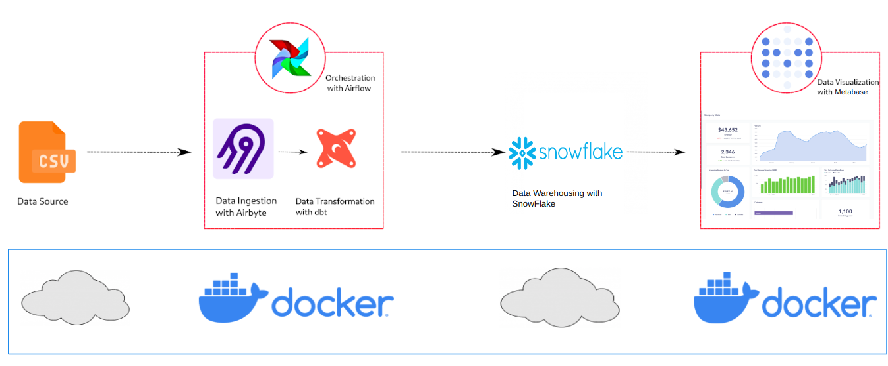

# Daily Covid 19 ELT With Modern Data Stack

This repo contains the project developed in the <a href="https://stackacademy.com.br">Stack Academy </a>'s Modern Data Stack training.

## Contents

- Problem Statement
- The Data
- Solution Architecture
- Conclusion (_TODO_)
- Next Steps (_TODO_)
- Lessons Learned (_TODO_)

## Problem Statement

Our team was asked to implement a simple ELT pipeline in order to provide daily Covid 19 data to the BI team.

In this way, we'll have to gather raw data and loads it into a data warehouse. Then, we'll have to make some basic transformations and join them to make them ready for visualizations.

## The Data

The data used in this project can be found in <a href="https://health.google.com/covid-19/open-data/raw-data"> this link</a>. They can be downloaded as .csv or .json files. We used the following datasets:

- Epidemiology
- Economy
- Demographics
- Index

The data are related as follows:

  

## Solution Architecture and Tools

  

The architecture looks like the image above. We'll make some data ingestion into a data warehouse, then we'll perform trasformations to prepare the data (and saving them into a new table). All of this will be orchestrated in order to run daily.

We'll end up with the following tools for each step of our workflow:

  

- **Airbyte for Ingestion**: since it is easy to use and is able to connect to many sources and destinations (on-premises and cloud resources)

- **Dbt for Data Transformations**: since it handles both simple and complex transformations and take away the need to use more complex tools.

- **Airflow for Orchestration**: even though most of tools used here have their on orchestration, we'll concentrate all of them in Airflow, since it has connectors to all of them and it is good scheduler.

- **Snowflake for Data Warehousing**: since it is in cloud and manage, so we don't have to worry about the infrastructure management.

## Conclusion (_TODO_)

## Next Steps (_TODO_)

## Lessons Learned (_TODO_)