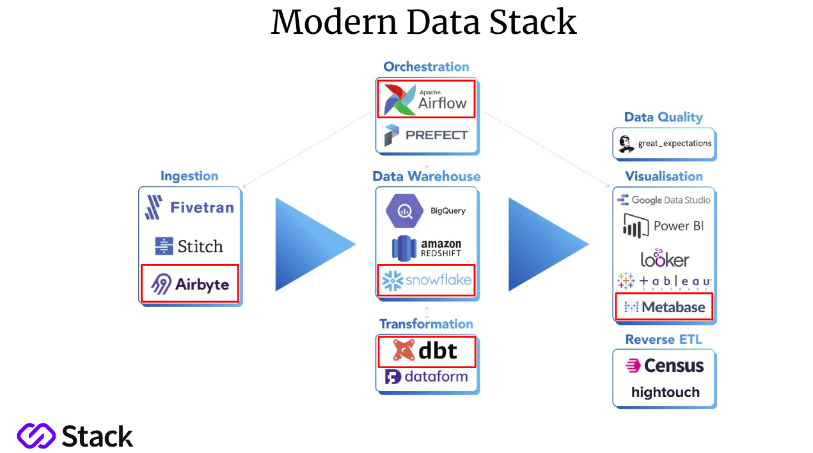

# Data Engineering with Modern Data Stack

  

## What a "Data Stack" is and the role of "modern"

A Data Stack is a set, combination of tools used to facilitate the entire data pipeline, that is, data collection, data processing, data management, data storage, and data accessing. 

The thing is that lately the data stack is envolving, moving from on-premise to cloud, shifting from ETL to ELT, and requiring less technical configuration by the data engineer. That means a Modern Data Stack has some extra features: higher speed, modularization, and lower cost.

In summary, Modern Data Stack is an Architecture where we can choose which tools we want to use among so many available ones. In this way, in just a few minutes, we can provide the entire structure we need for data pipelines.

## The benefits of a Modern Data Stack

The advent of cloud computing and storage brought a lot of advantages to the general IT process in many companies, specially related to cost reduction, storage and processing efficiency, and software avaialbility (among many others). So, Modern Data Stack saves money, time and effort. Besides that, it also brings scalability, speed, and accessibility

